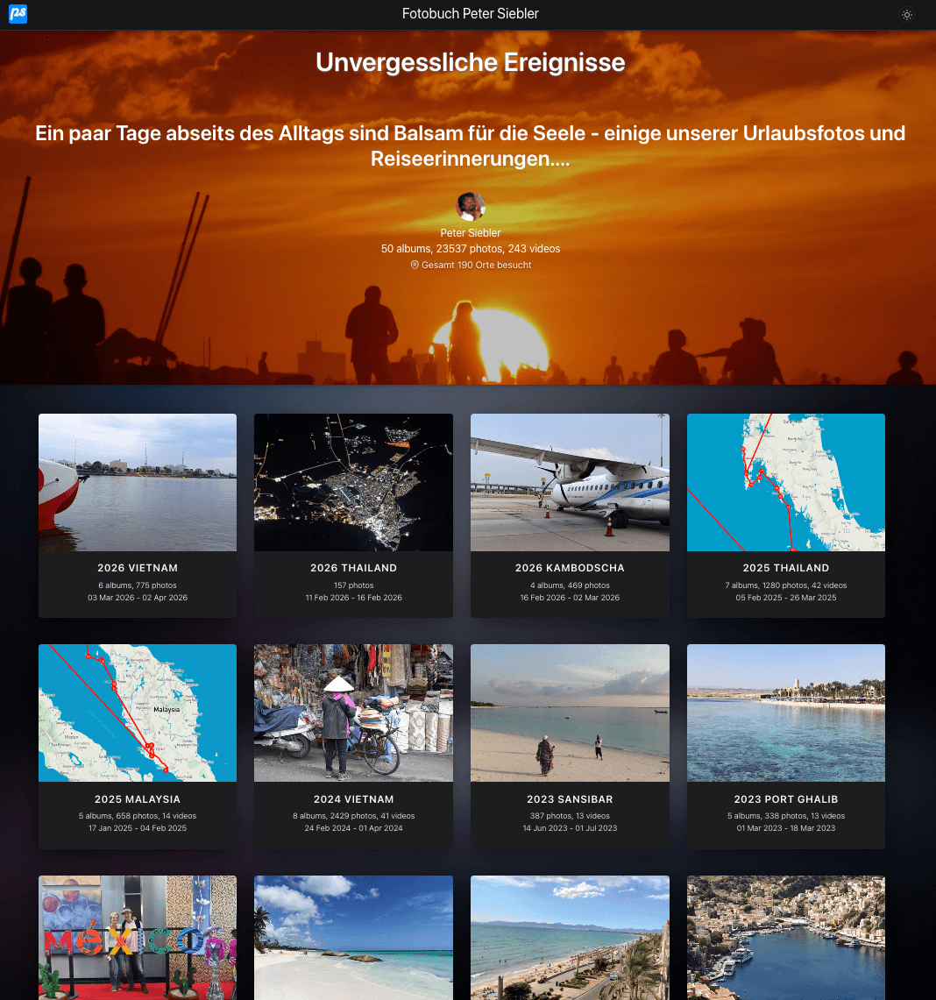

# thumbsup Fotogalerie – Docker Setup



## Überblick

Docker-basierter **thumbsup v2.18.0** Galerie-Generator mit Custom Theme (`theme-cards-flow`).
Alle Abhängigkeiten (Node.js 20, exiftool, GraphicsMagick, ffmpeg) laufen im Container.
Kein Node.js auf dem Host erforderlich.

## Application Workflow

```
┌────────────────────────────────────────────────────────────────────────┐
│                          make album NAME=fotobuch                      │
└───────────────────────────────────┬────────────────────────────────────┘
                                    │
                                    ▼
┌────────────────────────────────────────────────────────────────────────┐
│  Docker Container (node:20-bookworm + thumbsup@2.18.0)                 │
│                                                                        │
│  1. Config Merge                                                       │
│     ┌────────────────┐     ┌──────────────┐     ┌──────────────────┐   │
│     │ _defaults/     │  +  │ album.json   │  →  │ /config/         │   │
│     │ config.json    │     │ (Overrides)  │     │ config.json      │   │
│     │ settings.json  │     │              │     │ settings.json    │   │
│     └────────────────┘     └──────────────┘     └──────────────────┘   │
│                                                                        │
│  2. thumbsup --config /config/config.json                              │
│     ┌────────────────┐                          ┌──────────────────┐   │
│     │ /photos/ (ro)  │                          │ /output/         │   │
│     │ ├── Album 1/   │  → exiftool → GM →       │ ├── index.html   │   │
│     │ ├── Album 2/   │    Thumbnails +          │ ├── albums/      │   │
│     │ └── ...        │    HTML generieren       │ ├── media/       │   │
│     └────────────────┘                          │ └── public/      │   │
│                                                 └──────────────────┘   │
│  3. Photomap (GPS → Leaflet-Karte)                                     │
│     ┌────────────────┐                          ┌──────────────────┐   │
│     │ EXIF GPS-Daten │  → tools/photomap/ →     │ /output/photomap/│   │
│     │ aus allen Fotos│    Koordinaten + HTML    │ index.html       │   │
│     └────────────────┘                          └──────────────────┘   │
└────────────────────────────────────────────────────────────────────────┘
                                    │
                                    ▼
┌────────────────────────────────────────────────────────────────────────┐
│  fotobooks/www/fotobuch/  (statische HTML-Galerie, Webserver-ready)    │
│                                                                        │
│  make preview  → python3 -m http.server 8080                           │
│  make publish_nas  → rsync/scp auf NAS                                 │
│  make publish_server → scp auf Webserver                               │
└────────────────────────────────────────────────────────────────────────┘
```

---

## Schnellstart


### Schritt-für-Schritt-Installation

1. Repository klonen und Verzeichnis betreten
    ```bash
    git clone https://github.com/zibous/webfotos.git
    cd webfotos
    ```

2. Docker-Image bauen
    ```bash
    # Image bauen
    make build

    # Neues Album anlegen
    mkdir -p fotobooks/meinalbum
    echo '{"title": "Mein Album", "covertitle": "Meine Reisen"}' > fotobooks/meinalbum/album.json

    # Fotos reinkopieren (Unterordner = Alben)
    cp -r /pfad/zu/fotos/* fotobooks/meinalbum/

    # Album generieren
    make album NAME=meinalbum

    # Vorschau im Browser
    make preview
    # → http://localhost:8080/meinalbum/
    ```

---

## Projektstruktur

```
webfotos/
├── fotobooks/
│   ├── _defaults/              ← Basis-Konfiguration (für alle Alben)
│   │   ├── config.json         ← thumbsup Hauptconfig
│   │   └── settings.json       ← Theme-Settings
│   ├── fotobuch/               ← Ein Album (Fotos direkt hier)
│   │   ├── album.json          ← Album-spezifische Overrides
│   │   ├── _cover.jpg          ← Galerie-Cover
│   │   ├── 1978 Ascona/
│   │   ├── 2015 Thailand/
│   │   └── ...
│   ├── testalbum/              ← Weiteres Album
│   │   ├── album.json
│   │   ├── gallerycover.jpg
│   │   ├── 1998 Ascona/
│   │   └── ...
│   └── www/                    ← Generierte Galerien (Webserver-Root)
│       ├── fotobuch/
│       └── testalbum/
├── theme-cards-flow/
│   ├── theme/                  ← Handlebars-Templates, Helpers, Assets
│   └── tools/photomap/         ← Karten-Generierung (GPS-Daten)
├── scripts/
│   └── merge-config.js         ← Mergt Defaults + Album-Overrides
├── patches/
│   └── patch-metadata.sh       ← Patch für thumbsup metadata.js
├── Dockerfile
├── docker-compose.yml
└── Makefile
```

---

## Konfiguration

### Basis-Konfiguration (`fotobooks/_defaults/`)

Gilt für alle Alben. Enthält Standardwerte für Bildqualität, Sortierung,
Theme-Pfade, Footer, Copyright etc.

### Album-spezifische Overrides (`fotobooks/<name>/album.json`)

Nur die Werte die vom Standard abweichen:

```json
{
    "title": "Fotobuch Peter Siebler",
    "covertitle": "Unvergessliche Ereignisse"
}
```

Mögliche Keys aus `config.json` (thumbsup):
- `title` – Galerie-Titel
- `sort-albums-direction` – `asc` oder `desc`
- `large-size` – Größe der Vollbilder

Mögliche Keys aus `settings.json` (Theme):
- `covertitle` – Text auf dem Cover-Bild
- `menutitle` – Menü-Überschrift
- `application` – App-Name

Beim Build werden Defaults und Overrides automatisch gemergt.

---

## Make-Befehle

| Befehl | Beschreibung |
|---|---|
| `make build` | Docker Image bauen |
| `make rebuild` | Image neu bauen (ohne Cache) |
| `make album NAME=xxx` | Album generieren |
| `make photomap NAME=xxx` | Nur Karten-Daten generieren |
| `make preview` | Webserver starten (Port 8080) |
| `make shell NAME=xxx` | Container Shell öffnen |
| `make check` | Versionen und Patch prüfen |
| `make clean NAME=xxx` | Album-Output löschen |

---

## Features

### Foto-Map (GPS-Karte)

Nach dem Build wird automatisch eine Karten-Seite generiert (`photomap/`).
Sie zeigt alle Alben mit GPS-Daten auf einer OpenStreetMap-Karte (Leaflet).

Erreichbar unter: `http://server:8080/<album>/photomap/`

### Metadaten-Anzeige

Die LightGallery zeigt EXIF-Daten, GPS-Koordinaten und eine Mini-Karte
pro Foto an (Plugin `lg-metadata`).

### Theme-Anpassungen

Das Theme wird per Volume gemountet. Änderungen an `.hbs`, `.less` oder
Helper-Dateien sind sofort beim nächsten `make album` wirksam – kein
`make build` nötig.

---

## Patch (automatisch)

thumbsup wird beim Image-Build gepatcht:

| Datei | Änderung |
|---|---|
| `src/model/metadata.js` | `this.all = exiftool` – Zugriff auf alle EXIF-Felder |

Der Patch liegt in `patches/patch-metadata.sh` und wird beim
`docker compose build` automatisch angewendet.

---

## Voraussetzungen

- Docker Engine + Docker Compose (Linux) oder Docker Desktop (macOS/Windows)
- Make

Kein Node.js, exiftool, GraphicsMagick etc. auf dem Host nötig.

---

## Troubleshooting

```bash
# Container Shell öffnen
make shell NAME=testalbum

# Patch prüfen
make check

# Image komplett neu bauen
make rebuild

# Album-Output löschen und neu generieren
make clean NAME=testalbum
make album NAME=testalbum
```

## Infos

https://bitbucket.org/peter_siebler/theme-cards-flow/src/master/
https://bitbucket.org/peter_siebler/theme-cards-flow/src/25e008c271cc5383b4cb66443a73948bf0c3d6d5/theme/helpers/README.md
https://bitbucket.org/peter_siebler/theme-cards-flow/src/25e008c271cc5383b4cb66443a73948bf0c3d6d5/tools/README.md
https://github.com/thumbsup/thumbsup

update default Node version to 20 in Docker
https://github.com/psa/thumbsup/
